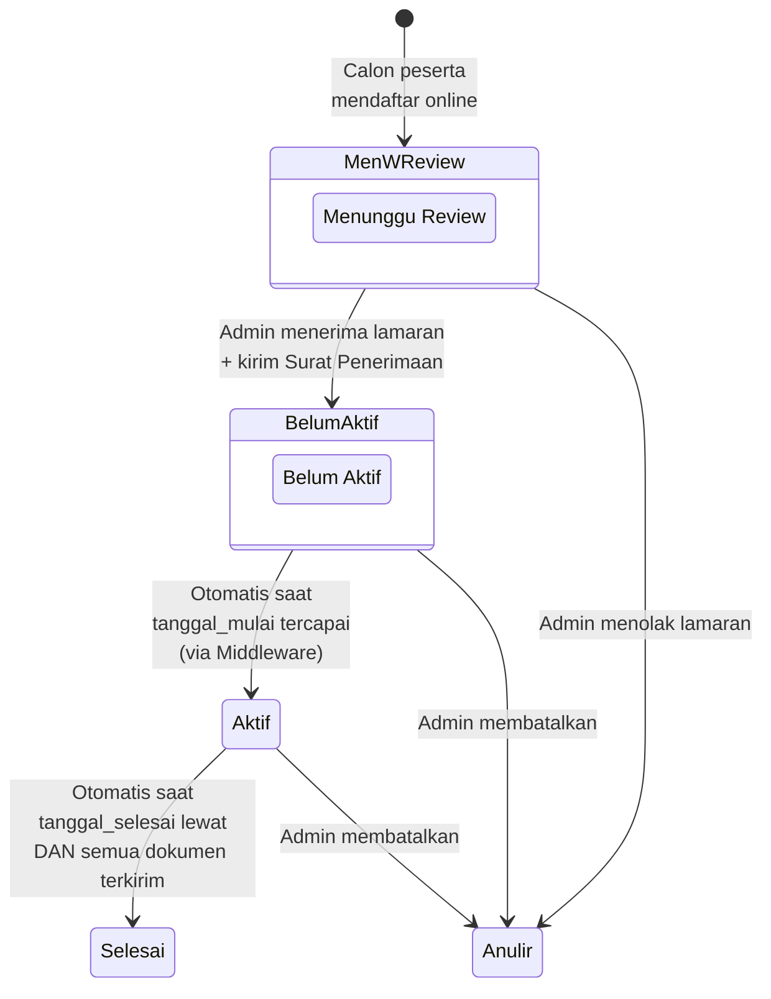

<p align="center">
  
</p>

<h1 align="center">Portal Magang PUSDATIN</h1>

<p align="center">
  Sistem Manajemen Magang Digital — Pusat Data dan Teknologi Informasi,<br>
  Sekretariat Jenderal, Kementerian Pekerjaan Umum
</p>

<p align="center">
  
  
  
  
  
</p>

---

## 📋 Daftar Isi

- [Tentang Proyek](#-tentang-proyek)
- [Fitur Utama](#-fitur-utama)
- [Tech Stack](#-tech-stack)
- [Arsitektur Sistem](#-arsitektur-sistem)
- [Prasyarat](#-prasyarat)
- [Instalasi & Setup](#-instalasi--setup)
- [Menjalankan Aplikasi](#-menjalankan-aplikasi)
- [Struktur Proyek](#-struktur-proyek)
- [Alur Bisnis](#-alur-bisnis)
- [Skema Database](#-skema-database)
- [API & Route](#-api--route)
- [Generate Dokumen PDF](#-generate-dokumen-pdf)
- [Deployment dengan Docker](#-deployment-dengan-docker)
- [Screenshot](#-screenshot)
- [Kontributor](#-kontributor)
- [Lisensi](#-lisensi)

---

## 🏢 Tentang Proyek

**Portal Magang PUSDATIN** adalah sistem informasi berbasis web yang digunakan untuk mengelola seluruh siklus magang di Pusat Data dan Teknologi Informasi, Kementerian Pekerjaan Umum — mulai dari pendaftaran online, review lamaran, penempatan, hingga penerbitan dokumen resmi (surat penerimaan, SK magang, lembar evaluasi, dan sertifikat kelulusan).

Sistem ini menggantikan proses manual berbasis spreadsheet menjadi alur kerja digital terintegrasi yang mencakup:

- **Landing page publik** dengan informasi kuota magang real-time per tim kerja
- **Form pendaftaran online** untuk calon peserta magang
- **Dashboard admin** lengkap untuk manajemen data peserta
- **Otomasi dokumen PDF** dengan template surat resmi kementerian
- **Pengiriman email otomatis** ke peserta dan institusi terkait

---

## ✨ Fitur Utama

### 🌐 Sisi Publik (Calon Peserta)
| Fitur | Deskripsi |
|-------|-----------|
| **Landing Page** | Informasi bidang & tim kerja, kuota tersedia secara real-time |
| **Form Pendaftaran** | Upload CV, surat rekomendasi, pas foto, pilihan 2 tim kerja |
| **Anti-Spam** | Rate limiting (maks 5 request/menit per IP) |

### 🔐 Sisi Admin (Dashboard)
| Fitur | Deskripsi |
|-------|-----------|
| **Dashboard** | KPI cards, pemantauan kuota real-time, notifikasi lamaran baru |
| **Lamaran Masuk** | Review pipeline — preview CV, terima/tolak lamaran |
| **Manajemen Magang** | Master data peserta dengan tabs status, popup modal detail, import/export Excel |
| **Pusat Dokumen** | Generate, preview, download, dan kirim email dokumen PDF |
| **Arsip Dokumen** | Arsip lengkap dokumen yang telah diterbitkan, download bulk |
| **Manajemen User** | CRUD akun admin |
| **Foto Akses** | Log foto akses peserta magang |
| **Activity Log** | Riwayat aktivitas admin |

### 📄 Dokumen yang Dapat Di-generate
| Dokumen | Deskripsi |
|---------|-----------|
| **Surat Penerimaan** | Surat konfirmasi kerja praktik (di-generate saat menerima lamaran) |
| **SK Magang** | Surat keterangan magang resmi |
| **Lembar Evaluasi** | Form penilaian 10 aspek (Integritas, Kualitas Kerja, dll.) |
| **Sertifikat** | Sertifikat kelulusan magang (landscape A4 dengan bingkai emas) |

---

## 🛠 Tech Stack

| Layer | Teknologi |
|-------|-----------|
| **Backend** | PHP 8.3, Laravel 13 |
| **Frontend** | Blade Templates, Tailwind CSS 4, Vite 8 |
| **Database** | MySQL 8.0 |
| **PDF Engine** | DomPDF (via `barryvdh/laravel-dompdf`) |
| **Excel** | PhpSpreadsheet (import/export data) |
| **Email** | SMTP (Gmail / konfigurasi lain) |
| **Containerization** | Docker & Docker Compose |
| **Web Server** | Apache (XAMPP / Docker) |

---

## 🏗 Arsitektur Sistem

```
┌─────────────────────────────────────────────────────────┐
│                    BROWSER (Client)                      │
├──────────────────┬──────────────────────────────────────┤
│   Landing Page   │          Admin Dashboard              │
│   + Pendaftaran  │  (Auth Required)                      │
├──────────────────┴──────────────────────────────────────┤
│                                                          │
│              Laravel 13 (PHP 8.3)                        │
│  ┌──────────┐ ┌──────────┐ ┌───────────┐ ┌───────────┐ │
│  │Controller│ │  Models  │ │   Mail    │ │ Middleware│  │
│  │  (13x)   │ │  (4x)    │ │  (4x)     │ │  (Auth +  │ │
│  │          │ │          │ │           │ │  Aktivasi)│  │
│  └──────────┘ └──────────┘ └───────────┘ └───────────┘  │
│       │              │           │                       │
│  ┌────▼──────────────▼───────────▼──────────────────┐   │
│  │              MySQL 8.0 Database                   │   │
│  │  ┌─────────────┐ ┌──────────┐ ┌───────────────┐  │   │
│  │  │peserta_magang│ │tim_kerja │ │activity_logs  │  │   │
│  │  └─────────────┘ └──────────┘ └───────────────┘  │   │
│  └──────────────────────────────────────────────────┘   │
│       │                                                  │
│  ┌────▼──────────────────────────────────────────────┐  │
│  │         DomPDF Engine (PDF Generation)             │  │
│  │  Surat Penerimaan │ SK Magang │ Evaluasi │ Sertif. │  │
│  └───────────────────────────────────────────────────┘  │
└─────────────────────────────────────────────────────────┘
```

---

## 📦 Prasyarat

### Lokal (XAMPP / Manual)
- **PHP** ≥ 8.3
- **Composer** ≥ 2.x
- **Node.js** ≥ 18.x + NPM
- **MySQL** ≥ 8.0
- **Git**

### Docker
- **Docker** ≥ 20.x
- **Docker Compose** ≥ 2.x

---

## 🚀 Instalasi & Setup

### Opsi 1: Setup Lokal (XAMPP)

```bash
# 1. Clone repository
git clone https://github.com/<username>/magang-pusdatin.git
cd magang-pusdatin

# 2. Install dependencies PHP
composer install

# 3. Setup environment
cp .env.example .env
php artisan key:generate

# 4. Konfigurasi database di file .env
#    Ubah sesuai setting MySQL lokal Anda:
#    DB_CONNECTION=mysql
#    DB_HOST=127.0.0.1
#    DB_PORT=3306
#    DB_DATABASE=magang_pusdatin
#    DB_USERNAME=root
#    DB_PASSWORD=

# 5. Buat database
mysql -u root -e "CREATE DATABASE IF NOT EXISTS magang_pusdatin"

# 6. Jalankan migrasi & seeder
php artisan migrate
php artisan db:seed

# 7. Buat symlink storage
php artisan storage:link

# 8. Install dependencies frontend & build
npm install
npm run build
```

### Opsi 2: Setup Cepat (Composer Script)

```bash
git clone https://github.com/<username>/magang-pusdatin.git
cd magang-pusdatin
composer setup
```

> **Catatan:** Pastikan database MySQL sudah tersedia dan konfigurasi `.env` sudah benar sebelum menjalankan `composer setup`.

### Opsi 3: Docker (Lihat [Deployment dengan Docker](#-deployment-dengan-docker))

---

### ⚙️ Konfigurasi Email (Opsional)

Untuk mengaktifkan fitur pengiriman email dokumen ke peserta, konfigurasi SMTP di `.env`:

```env
MAIL_MAILER=smtp
MAIL_HOST=smtp.gmail.com
MAIL_PORT=587
MAIL_USERNAME=email@domain.com
MAIL_PASSWORD=your-app-password
MAIL_ENCRYPTION=tls
MAIL_FROM_ADDRESS="email@domain.com"
MAIL_FROM_NAME="Pusdatin Kementerian PU"
```

> Untuk Gmail, gunakan [App Password](https://support.google.com/accounts/answer/185833), bukan password akun utama.

---

## ▶️ Menjalankan Aplikasi

### Development Server (Lengkap)

```bash
composer dev
```

Perintah ini menjalankan 4 proses secara bersamaan:
| Proses | Fungsi | Port |
|--------|--------|------|
| `php artisan serve` | Laravel server | `localhost:8000` |
| `php artisan queue:listen` | Queue worker (email) | — |
| `php artisan pail` | Real-time log viewer | — |
| `npm run dev` | Vite HMR | `localhost:5173` |

### Atau Jalankan Manual

```bash
# Terminal 1: Laravel server
php artisan serve

# Terminal 2: Vite (hot reload CSS/JS)
npm run dev

# Terminal 3: Queue worker (untuk email)
php artisan queue:listen
```

Buka browser: **http://localhost:8000**

---

## 📁 Struktur Proyek

```
magang-pusdatin/
├── app/
│   ├── Http/
│   │   ├── Controllers/
│   │   │   ├── AdminDashboardController.php   # Dashboard KPI & statistik
│   │   │   ├── AdminUserController.php        # CRUD akun admin
│   │   │   ├── ArsipDokumenController.php     # Arsip & download bulk
│   │   │   ├── AuthController.php             # Login/logout
│   │   │   ├── FotoAksesController.php        # Log foto akses
│   │   │   ├── LamaranMasukController.php     # Review & terima/tolak lamaran
│   │   │   ├── LandingPageController.php      # Landing page + API kuota
│   │   │   ├── ManajemenMagangController.php  # Master data + import/export
│   │   │   ├── PendaftaranController.php      # Form pendaftaran publik
│   │   │   ├── ProfileController.php          # Profil admin
│   │   │   ├── PusatDokumenController.php     # Generate SK, Evaluasi, Sertifikat
│   │   │   └── SuratPenerimaanController.php  # Generate Surat Penerimaan
│   │   └── Middleware/
│   │       └── AktifkanPesertaMagang.php      # Auto-activate saat tanggal mulai
│   ├── Mail/
│   │   ├── SuratEvaluasiMail.php
│   │   ├── SuratKeteranganMail.php
│   │   ├── SuratPenerimaanMail.php
│   │   └── SuratSertifikatMail.php
│   └── Models/
│       ├── ActivityLog.php                     # Log aktivitas admin
│       ├── PesertaMagang.php                   # Model utama peserta
│       ├── TimKerja.php                        # Tim kerja & kuota
│       └── User.php                            # Akun admin
├── database/
│   ├── migrations/                             # 14 file migrasi
│   └── seeders/
│       ├── DatabaseSeeder.php
│       ├── PesertaMagangSeeder.php             # Data dummy peserta
│       └── TimKerjaSeeder.php                  # Data tim kerja dari SK Personil
├── resources/views/
│   ├── admin/
│   │   ├── arsip/                              # Halaman arsip dokumen
│   │   ├── dashboard/                          # Dashboard KPI
│   │   ├── dokumen/
│   │   │   ├── index.blade.php                 # Pusat Dokumen (SK, Evaluasi, Sertifikat)
│   │   │   ├── template-sk-magang.blade.php    # Template PDF: SK Magang
│   │   │   ├── template-evaluasi.blade.php     # Template PDF: Lembar Evaluasi
│   │   │   └── template-sertifikat.blade.php   # Template PDF: Sertifikat
│   │   ├── lamaran/                            # Review lamaran masuk
│   │   ├── manajemen/                          # Master data peserta
│   │   ├── surat/
│   │   │   └── template.blade.php              # Template PDF: Surat Penerimaan
│   │   └── users/                              # Manajemen akun admin
│   ├── emails/                                 # Template email
│   ├── layouts/                                # Layout utama (app, admin)
│   ├── pendaftaran/                            # Form pendaftaran publik
│   └── welcome.blade.php                       # Landing page
├── public/
│   ├── logo_pu.png                             # Logo Kementerian PU
│   ├── logo_PUSDATIN.png                       # Logo PUSDATIN
│   ├── bg_bingkai.png                          # Bingkai emas sertifikat
│   └── fonts/                                  # Font Monotype Corsiva (sertifikat)
├── docker-compose.yml                          # Docker Compose config
├── Dockerfile                                  # Docker image build
├── composer.json
└── package.json
```

---

## 🔄 Alur Bisnis

### State Machine — Siklus Hidup Peserta Magang



### Alur Penerbitan Dokumen

| # | Tahap | Lokasi Menu | Trigger | Output |
|---|-------|-------------|---------|--------|
| 1 | **Surat Penerimaan** | Lamaran Masuk | Admin meng-ACC lamaran | PDF → Email peserta |
| 2 | **SK Magang** | Pusat Dokumen | Peserta berstatus Aktif | PDF → Email peserta |
| 3 | **Lembar Evaluasi** | Pusat Dokumen | Mendekati akhir magang | PDF → Email institusi |
| 4 | **Sertifikat** | Pusat Dokumen | Setelah magang selesai | PDF → Email peserta |

---

## 🗄 Skema Database

### Tabel `peserta_magang` (Tabel Utama)

| Kolom | Tipe | Deskripsi |
|-------|------|-----------|
| `id` | BIGINT | Primary key |
| `nama` | VARCHAR | Nama lengkap peserta |
| `tingkat_pendidikan` | VARCHAR | SMK / SLTA / Universitas |
| `nama_institusi` | VARCHAR | Nama sekolah/universitas |
| `jurusan` | VARCHAR | Program studi / jurusan |
| `nim_nis` | VARCHAR | NIM atau NIS |
| `email` | VARCHAR | Email pribadi peserta |
| `email_institusi` | VARCHAR | Email PJ institusi (untuk evaluasi) |
| `nomor_telp` | VARCHAR | Nomor telepon |
| `tanggal_mulai` | DATE | Tanggal mulai magang |
| `tanggal_selesai` | DATE | Tanggal selesai magang |
| `id_tim_kerja_1` | FK | Penempatan tim kerja (pilihan 1) |
| `id_tim_kerja_2` | FK | Pilihan tim kerja 2 (cadangan) |
| `cv` | VARCHAR | Path file CV |
| `surat_rekomendasi` | VARCHAR | Path file surat rekomendasi |
| `pas_foto` | VARCHAR | Path file pas foto |
| `status_magang` | ENUM | Menunggu Review / Belum Aktif / Aktif / Selesai / Anulir |
| `periode_magang` | JSON | Data periode magang |
| `surat_penerimaan_final` | VARCHAR | Path surat penerimaan yang ditandatangani |
| `surat_keterangan` | VARCHAR | Path SK Magang |
| `evaluasi_data` | JSON | Data nilai evaluasi (10 aspek) |
| `surat_evaluasi` | VARCHAR | Path lembar evaluasi |
| `sertifikat_data` | JSON | Data sertifikat (nomor, predikat) |
| `surat_sertifikat` | VARCHAR | Path sertifikat |
| `is_sk_sent` | BOOLEAN | Status pengiriman SK Magang |
| `is_evaluasi_sent` | BOOLEAN | Status pengiriman evaluasi |
| `is_sertifikat_sent` | BOOLEAN | Status pengiriman sertifikat |

### Tabel `tim_kerja`

| Kolom | Tipe | Deskripsi |
|-------|------|-----------|
| `id` | BIGINT | Primary key |
| `nama_tim` | VARCHAR | Nama tim kerja |
| `bidang` | VARCHAR | Nama bidang induk |
| `kuota_maksimal` | INT | Kuota maksimal peserta magang |
| `ketua_tim` | VARCHAR | Nama ketua tim (pembimbing lapangan) |
| `nip_ketua_tim` | VARCHAR | NIP ketua tim |

### Tabel `activity_logs`

| Kolom | Tipe | Deskripsi |
|-------|------|-----------|
| `id` | BIGINT | Primary key |
| `jenis` | VARCHAR | Jenis aktivitas |
| `deskripsi` | TEXT | Detail aktivitas |

---

## 🌐 API & Route

### Route Publik

| Method | URI | Fungsi |
|--------|-----|--------|
| `GET` | `/` | Landing page |
| `GET` | `/api/quota-status` | API kuota tim kerja (JSON) |
| `GET` | `/pendaftaran` | Form pendaftaran |
| `POST` | `/pendaftaran` | Submit pendaftaran |

### Route Admin (Auth Required)

| Method | URI | Fungsi |
|--------|-----|--------|
| `GET` | `/admin/dashboard` | Dashboard KPI |
| `GET` | `/admin/lamaran` | Daftar lamaran masuk |
| `GET` | `/admin/lamaran/{id}` | Detail lamaran |
| `POST` | `/admin/lamaran/{id}/tolak` | Tolak lamaran |
| `POST` | `/admin/lamaran/{id}/surat/preview` | Preview surat penerimaan |
| `POST` | `/admin/lamaran/{id}/surat/download` | Download PDF surat penerimaan |
| `GET` | `/admin/manajemen` | Master data peserta |
| `GET` | `/admin/manajemen/export/data` | Export Excel |
| `POST` | `/admin/manajemen/import` | Import Excel |
| `GET` | `/admin/dokumen` | Pusat dokumen |
| `GET` | `/admin/dokumen/sk-magang/{id}/preview` | Preview SK Magang |
| `GET` | `/admin/dokumen/sk-magang/{id}/download` | Download PDF SK |
| `GET` | `/admin/dokumen/evaluasi/{id}/preview` | Preview evaluasi |
| `GET` | `/admin/dokumen/evaluasi/{id}/download` | Download PDF evaluasi |
| `GET` | `/admin/dokumen/sertifikat/{id}/preview` | Preview sertifikat |
| `GET` | `/admin/dokumen/sertifikat/{id}/download` | Download PDF sertifikat |
| `GET` | `/admin/arsip-dokumen` | Arsip semua dokumen |

---

## 📄 Generate Dokumen PDF

Sistem menggunakan **DomPDF** untuk generate dokumen PDF dengan template HTML yang menggunakan base64-encoded images agar rendering konsisten di browser preview maupun PDF.

### Template Dokumen

| Template | Layout | Fitur Khusus |
|----------|--------|--------------|
| `template.blade.php` | Portrait A4 | Kop surat resmi kementerian |
| `template-sk-magang.blade.php` | Portrait A4 | Info pemberi keterangan + data peserta |
| `template-evaluasi.blade.php` | Portrait A4 | Tabel penilaian 10 aspek, auto-scale preview |
| `template-sertifikat.blade.php` | **Landscape A4** | Bingkai emas, font Monotype Corsiva, 4 logo |

### Alur Generate

```
1. Admin klik "Preview" → Controller render HTML (is_pdf=false) → Tampil di iframe
2. Admin klik "Download" → Controller render HTML (is_pdf=true) → DomPDF convert ke PDF
3. Admin upload surat TTD → Simpan ke storage + kirim email ke peserta/institusi
```

---

## 🐳 Deployment dengan Docker

```bash
# 1. Clone & masuk ke direktori proyek
git clone https://github.com/<username>/magang-pusdatin.git
cd magang-pusdatin

# 2. Salin file environment Docker
cp .env.docker .env

# 3. Build & jalankan container
docker compose up --build

# 4. Akses aplikasi
# App: http://localhost:8080
# DB:  localhost:3307
```

### Services

| Service | Container | Port | Deskripsi |
|---------|-----------|------|-----------|
| `app` | `magang-app` | `8080:80` | PHP 8.3 + Apache + Laravel |
| `db` | `magang-db` | `3307:3306` | MySQL 8.0 |

### Persistent Volumes

- `app_storage` — File upload peserta (CV, surat, foto)
- `db_data` — Data MySQL

### Bind Mounts (Development)

Perubahan pada file berikut langsung tercermin di container tanpa rebuild:
- `resources/views/` — Template Blade
- `app/` — Controller, Model, Mail
- `routes/` — Definisi route
- `config/` — Konfigurasi Laravel
- `database/` — Migrasi & seeder

---

## 📸 Screenshot

> _Tambahkan screenshot aplikasi di sini untuk memberikan gambaran visual kepada pengunjung repo._
>
> Contoh:
> ```
> 
> 
> 
> ```

---

## 👥 Kontributor

Proyek ini dikembangkan dalam rangka program magang di **Pusat Data dan Teknologi Informasi (PUSDATIN)**, Sekretariat Jenderal, Kementerian Pekerjaan Umum.

---

## 📄 Lisensi

Proyek ini dikembangkan untuk keperluan internal PUSDATIN Kementerian Pekerjaan Umum.
